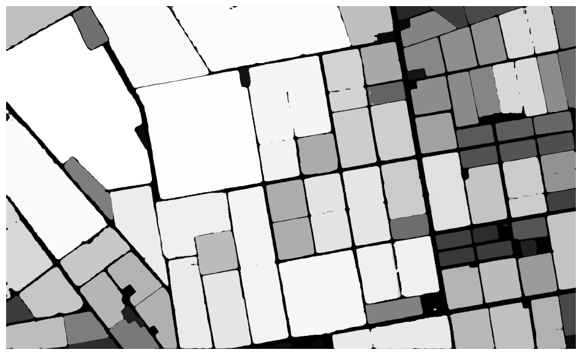

# ODP_Demo - 开放数据平台地理科学解决方案

<div align="center">


**基于AWS开放数据的地理空间AI分析平台**

[📚 中文文档](./docs/) | [🚀 快速开始](#快速开始) | [🛠️ 功能特性](#功能特性) | [📖 使用指南](#使用指南)

</div>

---

## 🌟 项目概述

ODP_Demo是一个综合性的地理科学解决方案包，集成了AWS开放数据平台、先进的AI图像分析技术和交互式地理可视化功能。项目通过18个精心设计的Jupyter notebook，展示了从基础地图创建到高级AI分析的完整工作流程。

### 🎯 核心价值

- **🌍 全球数据访问**: 集成Maxar、Planet、OpenAerialMap等多源卫星数据
- **🤖 AI驱动分析**: 基于SAM (Segment Anything Model) 的智能图像分割
- **💬 自然语言交互**: 支持文本提示的地理空间分析
- **📊 交互式可视化**: 基于Leafmap的动态地图和时序分析
- **🔧 即插即用**: 完整的AWS SageMaker部署方案

## 🛠️ 功能特性

### 📍 基础地理功能
- **交互式地图创建** - 多种底图源和自定义样式
- **数据可视化** - COG、STAC、WMS等多格式支持
- **空间分析** - 矢量数据处理和空间关系分析

### 🛰️ 多源数据集成
- **Maxar高分辨率影像** - 亚米级商业卫星数据
- **Planet日级监测** - 全球每日成像能力
- **开放航空地图** - 社区贡献的无人机影像
- **OpenStreetMap集成** - 矢量地理数据融合

### 🤖 AI图像分析
- **SAM自动分割** - 零样本图像分割技术
- **农业遥感应用** - 作物识别和长势监测
- **目标检测** - 建筑物、道路、水体等要素提取
- **变化检测** - 时序影像对比分析

### 💬 智能交互
- **文本提示分析** - 自然语言驱动的地理分析
- **批量处理** - 大规模自动化分析流程
- **专项应用** - 游泳池检测等特定目标识别

## 🚀 快速开始

### 环境要求

```bash
# 推荐环境配置
AWS SageMaker Instance: ml.g5.8xlarge
Platform: Amazon Linux 2, Jupyter Lab 4
Storage: 100GB EBS Volume
Python: 3.8+
CUDA: 11.0+ (用于AI功能)
```

### 一键部署

```bash
# 1. 克隆仓库
cd SageMaker
git clone https://github.com/ddipass/ODP_Demo.git
cd ODP_Demo

# 2. 快速部署环境
bash fast_deploy.sh

# 3. 启动Jupyter Lab
jupyter lab
```

### 核心依赖

```python
# 主要Python包
leafmap>=0.20.0      # 地理可视化
samgeo>=0.15.0       # SAM图像分割
geopandas>=0.13.0    # 地理数据处理
rasterio>=1.3.0      # 栅格数据处理
folium>=0.14.0       # 交互式地图
```

## 📖 使用指南

### 🎓 学习路径

#### 初学者路径
1. **[地图创建基础](./docs/00_Demo_Features_地图创建功能详解.md)** - 掌握交互式地图创建
2. **[数据可视化](./docs/00_Demo_Features_数据可视化功能详解.md)** - 学习多源数据展示
3. **[数据搜索](./docs/01_ODP_Search_使用手册.md)** - 了解开放数据获取

#### 进阶用户路径
1. **[SAM图像分割](./docs/07_SAM_AutoMask_使用手册.md)** - AI图像分析入门
2. **[时序分析](./docs/05_Timelapse_使用手册.md)** - 动态变化监测
3. **[文本提示](./docs/11_Text_Prompts_使用手册.md)** - 智能交互分析

#### 专业应用路径
1. **[农业遥感](./docs/09_Agricultural_SAM_使用手册.md)** - 精准农业应用
2. **[灾害监测](./docs/06_Turkey_Earthquake_使用手册.md)** - 应急响应分析
3. **[批量处理](./docs/12_Text_Prompts_Batch_使用手册.md)** - 大规模自动化

### 📁 项目结构

```
ODP_Demo/
├── 📓 Jupyter Notebooks (18个)
│   ├── 00_Demo_Features.ipynb          # 基础功能演示
│   ├── 01_ODP_Search.ipynb             # 数据搜索
│   ├── 07_SAM_AutoMask.ipynb           # AI图像分割
│   └── ...
├── 📚 docs/                            # 完整中文文档
│   ├── README.md                       # 文档总览
│   ├── 00_Demo_Features_地图创建功能详解.md
│   └── ...
├── 🖼️ images/                          # 示例图像
├── 📊 cache/                           # 数据缓存
├── 🔧 fast_deploy.sh                   # 快速部署脚本
└── 📄 README.md                        # 项目说明
```

## 🎨 功能展示

### 🤖 AI图像分割效果
*SAM模型在地理影像中的自动分割效果*

<div align="center">


*SAM自动掩膜生成 - 建筑物和道路的精确分割*

</div>

### 🌾 农业遥感应用
*精准农业中的作物识别和分析*

<div align="center">



*农田分割和作物识别 - 支持精准农业管理*

</div>

### 💬 文本提示分析
*自然语言驱动的地理空间分析*

<div align="center">


*基于文本提示的智能地理分析*

</div>

### 🏊 专项目标检测
*游泳池检测等特定目标识别应用*

<div align="center">

/13_Text_Prompts%20(Swimming%20Pools)_cell_23_output_0_1.png)

*高精度游泳池自动检测 - 支持城市规划和房地产分析*

</div>

## 🔧 高级配置

### SageMaker环境设置

```python
# Jupyter Lab扩展检查
jupyter labextension list

# CUDA内存监控
conda install -c conda-forge nvitop
nvitop

# 磁盘空间检查
df -h
```

### 性能优化

```python
# GPU内存优化
import torch
torch.cuda.empty_cache()

# 数据缓存配置
import os
os.environ['GDAL_DISABLE_READDIR_ON_OPEN'] = 'EMPTY_DIR'
os.environ['CPL_VSIL_CURL_CACHE_SIZE'] = '200000000'
```

## 🤝 贡献指南

我们欢迎社区贡献！请查看以下方式参与项目：

- 🐛 **问题报告**: 在Issues中报告bug或提出功能请求
- 📝 **文档改进**: 帮助完善文档和示例
- 💻 **代码贡献**: 提交新功能或性能优化
- 🌍 **应用案例**: 分享您的应用场景和经验

## 📄 许可证

本项目采用 [MIT License](./LICENSE) 开源协议。

## 🙏 致谢

- **AWS开放数据计划** - 提供丰富的地理空间数据资源
- **Meta SAM团队** - 革命性的图像分割技术
- **Leafmap社区** - 优秀的地理可视化工具
- **开源社区** - 各种优秀的Python地理空间库

---

<div align="center">

**🌟 如果这个项目对您有帮助，请给我们一个Star！**

[](https://github.com/ddipass/ODP_Demo/stargazers)
[](https://github.com/ddipass/ODP_Demo/network)

</div>
